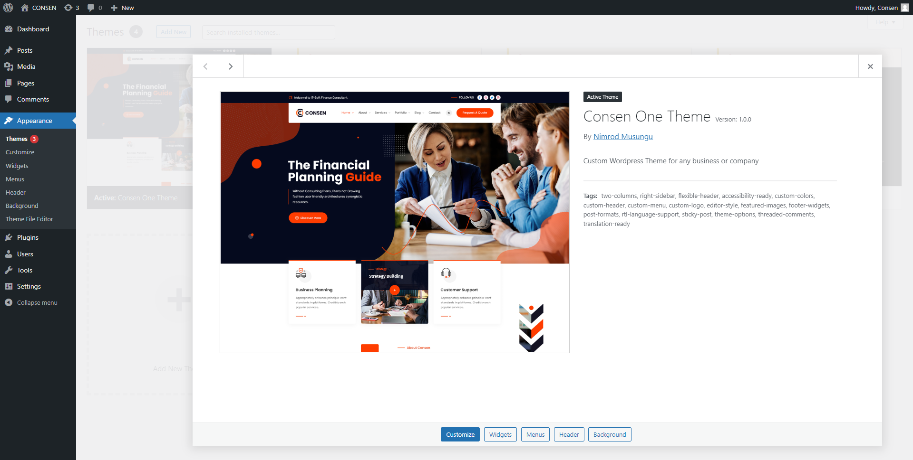

# ConsenOne Custom WordPress Theme

ConsenOne is a premium WordPress theme custom developed using PHP 8, MySQL, and using WordPress Rest API, Custom Post Types and Advanced Custom Fields. The Theme can be used by corporate businesses or companies and it offers easy customization, maintenance and expansion of features.

## Theme Preview

## Dashboard Preview

## Technologies Used

1. PHP 8
2. MySQL Database
3. WordPress settings API
4. WordPress
5. HTML5
6. CSS3
7. Bootstrap5.2
8. JavaScript / jQuery
9. Ajax

## Author
Nimrod Musungu